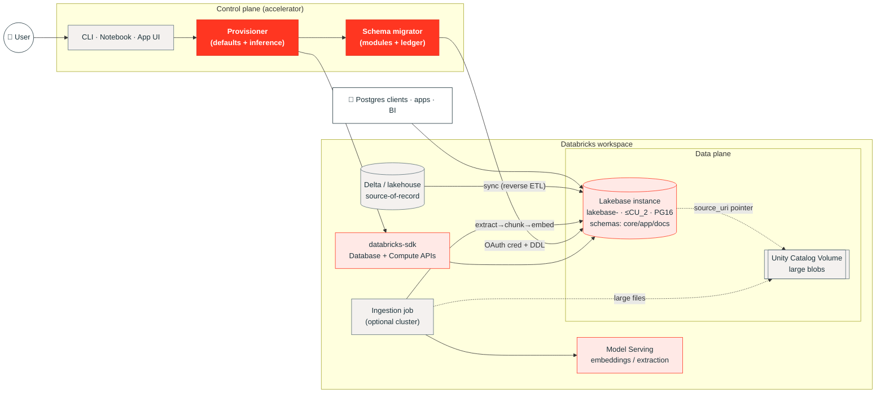

# Lakebase Accelerator — Design Specification

| | |
|---|---|
| **Status** | Draft for review |
| **Spec version** | 0.4.0 (targets accelerator `0.4.x`; current shipped is `0.3.0`) |
| **Last updated** | 2026-06-15 |
| **Owner** | manasreddy |
| **Scope** | Minimal-input provisioning · generic baseline schemas · unstructured data types |
| **Related** | `docs/architecture.mmd` (current control-plane diagram), `README.md` |

---

## 1. Summary

The Lakebase Accelerator is today a **use-case-agnostic Databricks control plane**: pick a use-case name, get isolated, cost-guarded infrastructure, tear it down to stop billing. It exposes three interfaces (CLI, notebook, Databricks App) and two resource styles (cost-tuned **clusters** via Asset Bundles; **Lakebase managed-Postgres instances** via the Database API).

This spec extends the accelerator from "provision an empty database/cluster" to "provision a **ready-to-use data plane**" along three axes the product is missing:

1. **Reduce input from the user** — collapse a dozen knobs to *one required field* (the use-case name) via convention, inference, and profile presets, with a single optional manifest for overrides.
2. **Generic baseline schemas** — after an instance is up, bootstrap a flexible, conventional, migration-managed schema so the database is immediately useful without bespoke data modeling.
3. **Unstructured data types** — first-class support for JSONB, full-text search, vector embeddings, and binary/large-object storage (inline vs. Unity Catalog Volume tiering), with an ingestion pipeline that bridges the lakehouse to the Lakebase serving layer.

These are additive and backward compatible: existing CLI/App/notebook flows keep working; the new behavior is opt-in via defaults that lean toward "do the useful thing."

---

## 2. Table of contents

1. Summary
2. TOC
3. Current state (as-built, accurate)
4. Goals & non-goals
5. Design principles
6. Personas & primary journeys
7. Target architecture
8. Detailed design
   - 8.1 Minimal-input provisioning
   - 8.2 Generic schema system
   - 8.3 Unstructured data subsystem
   - 8.4 Ingestion & lakehouse bridge
   - 8.5 Unified control-plane surface
   - 8.6 Discovery, state & idempotency
   - 8.7 Security & governance
   - 8.8 Cost governance
   - 8.9 Observability
9. Configuration reference (manifest + defaulting)
10. Data model reference (DDL)
11. API & CLI surface
12. Rollout plan
13. Testing strategy
14. Risks & open questions
15. Appendix: glossary & references

---

## 3. Current state (as-built)

This section describes what exists today, grounded in the code, so the design that follows is anchored to reality.

### 3.1 Interfaces

| Interface | Entry point | Provisions | State model |
|---|---|---|---|
| **CLI** | `accelerator/cli.py` → `accelerator/dab.py` | Per-use-case **cluster** (+ optional UC schema) via a generated `databricks.yml` Asset Bundle | Local: `.lakebase/<usecase>/databricks.yml` |
| **Notebook** | `notebooks/lakebase_control_panel.py` | **Cluster** via the SDK `clusters` API, widget-driven | None — discovered by `project` tag |
| **Databricks App** | `app/main.py` (FastAPI) + `app/service.py` + static UI | **Lakebase (managed Postgres) database instance** via the SDK Database API | None — discovered by `lakebase_project` tag (name-prefix fallback) |

### 3.2 What gets provisioned today

- **Clusters** (CLI/notebook): cost-tuned — per-cloud default node type (`m5d.large` / `Standard_D4s_v3` / `n2-standard-4`), autoscale 1–2 nodes or single-node, spot/preemptible workers with on-demand fallback, idle autotermination (default 20 min), `SINGLE_USER` security mode. Hard guardrail: `max_workers <= 2`.
- **Lakebase instances** (App): one isolated managed-Postgres instance per use case, slugified name `lakebase-<usecase>`, capacity capped at `CU_1`/`CU_2` (cost guardrail rejects `CU_4`/`CU_8`), optional restore window 2–35 days, stoppable (compute billing pauses, data retained), destroy purges storage.

### 3.3 Configuration surface today

- **CLI/cluster**: `cloud`, `max_workers`, `min_workers`, `spark_version`, `node_type_id`, `use_spot`, `single_node`, `autotermination_minutes`, `create_schema`, `catalog_name`, `custom_tags` — via env (`.env`), `--var k=v`, or `--vars-file JSON` (`Settings` dataclass in `accelerator/config.py`).
- **App/Lakebase**: `usecase` (required), `capacity` (default `CU_1`), `retention_days` (optional), `custom_tags` (optional) — via the deploy form / `DeployRequest`.

### 3.4 The gap this spec closes

1. **Two resource models, one name.** "Lakebase Accelerator" implies a Lakebase (Postgres) data plane, but two of three interfaces actually manage clusters. This spec makes the **Lakebase instance the primary artifact** and reframes clusters as optional *ingestion compute*.
2. **Empty databases.** A provisioned instance has no schema; every team reinvents the same tables. → §8.2.
3. **No unstructured story.** Postgres can do JSONB, FTS, vectors, and blobs, but the accelerator provides none of it. → §8.3.
4. **Too many knobs.** Cost-tuning is good, but the user still answers many questions to deploy. → §8.1.

---

## 4. Goals & non-goals

### Goals
- **G1 — One-input deploy.** `lakebase up <name>` (or one form field) yields a running instance with a usable baseline schema, sensible cost-safe defaults, and correct tags.
- **G2 — Generic, reusable schema.** A flexible core data model that fits catalog/operational-app/event-store/knowledge-base use cases without per-use-case modeling, extensible via JSONB and opt-in modules.
- **G3 — Unstructured-native.** JSONB, full-text search, vector search (pgvector), and binary/large-object tiering as built-in, documented capabilities with reference DDL.
- **G4 — Lakehouse bridge.** A documented path to populate Lakebase from Delta and to embed text via Databricks Model Serving.
- **G5 — Backward compatible.** Existing CLI/App/notebook commands and tests keep passing.
- **G6 — Cost-safe by default.** All new defaults stay inside existing guardrails (≤ CU_2, stoppable, tagged, isolated).

### Non-goals
- **N1** — Not a general ORM or app framework; we ship schema + conventions, not business logic.
- **N2** — Not a replacement for Unity Catalog governance of analytical data; Lakebase is the *operational/serving* tier.
- **N3** — No automatic, irreversible data migrations of *user* data; only additive, versioned schema migrations of accelerator-owned objects.
- **N4** — Not multi-region/HA design in this revision (single-instance per use case stands).

---

## 5. Design principles

1. **Convention over configuration.** Every field has a derivation rule; the user supplies only what diverges from convention.
2. **Workspace is the source of truth.** Continue tag-based discovery; avoid local state where possible (the App model wins over the CLI's local `.lakebase/` state for the data plane).
3. **Idempotent & re-runnable.** Deploy, schema apply, and ingest can all be re-run safely (checksums, `IF NOT EXISTS`, migration ledger).
4. **Cost-safe by default.** Defaults never exceed guardrails; everything is stoppable and tagged for cost attribution.
5. **Additive-only schema changes.** Accelerator migrations only add/extend; destructive changes require an explicit, versioned, opt-in step.
6. **Flexible core, typed edges.** Model the variable 80% as JSONB; reserve real columns for what you index, join, or constrain.
7. **Least privilege.** All workspace calls run as the App service principal; Postgres access uses short-lived Databricks-identity credentials, not static passwords.

---

## 6. Personas & primary journeys

| Persona | Wants | Journey |
|---|---|---|
| **App developer** | A Postgres to build on, fast | `lakebase up checkout` → gets instance + `core`/`app` schema + connection string → starts building |
| **Data/ML engineer** | A serving DB for RAG/features | `lakebase up kb --unstructured` → instance + `docs` schema (vectors) → runs ingest job → queries by similarity |
| **Platform owner** | Cost control & governance | Sees all instances by tag, stops idle ones, enforces ≤ CU_2, audits via tags |
| **Analyst (indirect)** | Operational data reflected from lakehouse | Engineer configures Delta→Lakebase sync; analyst reads governed reference tables |

**Headline journey (the "reduce input" win):**

```
$ lakebase up checkout
  ✓ cloud inferred: azure (from workspace host)
  ✓ instance: lakebase-checkout  (CU_1, Postgres 16, restore 7d)
  ✓ schema modules applied: core, app   (12 objects, migration v1..v3)
  ✓ endpoint: lakebase-checkout...:5432  sslmode=require
  → lakebase destroy checkout   when done
```

No flags. Everything else inferred or defaulted (§9).

---

## 7. Target architecture



**Layers:**
- **Control plane** — the accelerator: interfaces → provisioner (applies defaults/inference) → schema migrator (applies modules). Tag-based discovery, no authoritative local state for the data plane.
- **Data plane** — the Lakebase instance (primary), plus a UC Volume for large blobs.
- **Compute (optional)** — an ingestion job/cluster that extracts, chunks, and embeds unstructured content and writes into Lakebase. This is where the existing cluster provisioning earns its keep.
- **Bridges** — Model Serving for embeddings/extraction; Delta→Lakebase sync for reference data.

---

## 8. Detailed design

### 8.1 Minimal-input provisioning

**Objective:** the only required input is the use-case name. Everything else resolves through a deterministic precedence chain.

**Precedence (highest wins):**
1. Explicit input — CLI flag, API field, or form value.
2. Use-case **manifest** `lakebase.yaml` (optional file; see §9).
3. **Profile** preset — `sandbox` | `standard` | `prod` (bundles many knobs into one choice).
4. **Environment** variables (existing `.env` behavior, retained).
5. **Inference** from context (host → cloud; name → derived identifiers).
6. **Hard defaults** (cost-safe baselines).

**Inference rules:**

| Field | Inferred from | Rule |
|---|---|---|
| `cloud` | workspace host | `detect_cloud()` (already implemented) |
| `instance_name` | use-case name | `lakebase-<slug(name)>` (slug = lowercase, `_`→`-`) |
| `database` | use-case name | `slug(name)` (the logical PG database) |
| `pg_role` | use-case name | `<slug>_app` (least-priv role for clients) |
| `owner` | identity | `x-forwarded-email` (App) / `current_user` (CLI/notebook) |
| `tags` | context | always-on: `lakebase_project`, `usecase`, `managed`, `env`, `owner`, `created_at` |
| `volume` (blobs) | name + catalog | `<catalog>.lakebase_<slug>.files` |

**Profiles (the single most useful knob):**

| Profile | capacity | retention | RLS | schema modules | autostop hint |
|---|---|---|---|---|---|
| `sandbox` | CU_1 | 2 d | off | `core` | aggressive |
| `standard` *(default)* | CU_1 | 7 d | off | `core`, `app` | normal |
| `prod` | CU_2 | 35 d | on | `core`, `app` | conservative |

A user picks a profile (or accepts `standard`); the profile sets the cost/retention/security posture in one move. Any individual field can still be overridden via precedence levels 1–2.

**Result:** the App's deploy form reduces to **one field (name)** plus an optional Profile segmented control; "Advanced" keeps capacity/retention/tags for power users. The CLI's `up` subcommand takes a name and optional `--profile`.

### 8.2 Generic schema system

**Objective:** after provisioning, the database has a flexible, conventional schema that fits most use cases without bespoke modeling.

**Conventions — applied to every accelerator-owned table:**
- `id uuid primary key default gen_random_uuid()`
- `tenant_id uuid not null default '00000000-0000-0000-0000-000000000000'` (single-tenant sentinel by default; enables multi-tenant later without migration)
- `created_at timestamptz not null default now()`, `updated_at timestamptz not null default now()` (maintained by trigger)
- `created_by text`, `updated_by text`
- `metadata jsonb not null default '{}'::jsonb` (extend without DDL)
- `deleted_at timestamptz` (soft delete)
- Naming: `snake_case`, plural tables, `*_id` foreign keys, schema-per-module.

**Module catalog (opt-in, composable):**

| Module | Schema | Purpose | Key tables |
|---|---|---|---|
| `core` *(always)* | `core` | Universal flexible model | `entities`, `relationships`, `events`, `tags` |
| `app` | `app` | Operational app baseline | `users`, `sessions`, `audit_log`, `settings` |
| `docs` | `docs` | Unstructured / RAG (§8.3) | `collections`, `documents`, `document_chunks` |
| `agent` | `agent` | Stateful agent memory + governed eval (flagship use case — see `usecases/stateful-agent-backbone/`) | `threads`, `interactions`, `memories`, `feedback`, `eval_runs` |
| `meta` *(always)* | `lakebase_meta` | Accelerator bookkeeping | `schema_migrations`, `modules`, `ingest_runs` |

**The flexible-core idea:** `core.entities` is a typed, JSONB-attributed "thing" with a generated `tsvector`; `core.relationships` are typed edges (graph-like); `core.events` is an append-only, time-partitioned log. This trio models catalogs, operational records, audit/event streams, and simple graphs — the variable parts live in JSONB so no schema change is needed to add a field. Full DDL in §10.

**Migrations engine:**
- Each module is a set of numbered, idempotent SQL files: `migrations/<module>/NNN_*.sql`.
- A ledger table `lakebase_meta.schema_migrations(version, module, checksum, applied_at)` records what ran.
- The migrator (Python + `psycopg`) connects with a short-lived Databricks-identity credential, applies pending files in order inside transactions, and is safe to re-run (skips applied checksums; mismatched checksum on an applied version → hard error, never silent re-apply).
- The manifest's `schema.modules` selects which modules to apply; `core` + `meta` are always applied.

**Multi-tenancy:** off by default (single sentinel tenant). When `schema.multi_tenant: true`, the migrator enables Postgres **row-level security** with a policy keyed on a session GUC `app.tenant_id` (see §10.4). Clients set the GUC per connection/transaction.

### 8.3 Unstructured data subsystem

**Objective:** make non-tabular data a first-class, documented capability.

**Data-type matrix:**

| Data kind | Postgres mechanism | Index | Storage tier |
|---|---|---|---|
| Semi-structured records (variable attrs) | `jsonb` | GIN (`jsonb_path_ops`) | inline |
| Free text / documents | `text` + generated `tsvector` | GIN | inline |
| Embeddings / vectors | `vector(N)` (pgvector) | HNSW (or IVFFlat) | inline |
| Small binaries (≲ 1 MB) | `bytea` | — | inline |
| Large binaries (PDF/image/audio/video) | pointer: `source_uri` → UC Volume + extracted `content_text` + `embedding` | — | **Volume** |
| Geospatial *(optional ext)* | PostGIS `geography` | GiST | inline |
| Time-series | `core.events` partitioned by time | BRIN | inline/partitioned |

**Storage tiering rule (default):** content `< 1 MB` and `mime_type` text-like → store bytes/text inline; otherwise write the file to the use case's UC Volume and store only `source_uri` + extracted text + embedding in Postgres. Threshold configurable via `unstructured.inline_max_bytes`.

**The `docs` module** (full DDL in §10.3): `collections` (named vector spaces with `embedding_model`/`embedding_dim`), `documents` (one row per source object, with `storage_tier`, `source_uri`, `content_bytes`/`content_text`, generated `content_tsv`, `ingest_status`, dedupe `checksum`), and `document_chunks` (per-chunk text + `embedding vector(N)` for RAG retrieval). Hybrid search = FTS (`content_tsv`) ∪ vector similarity (`embedding`), re-ranked.

**Embedding model:** default `databricks-bge-large-en` (dim 1024) via Databricks Model Serving / Foundation Model API; configurable per collection so dim and index match the model. Vector dim is fixed at collection creation to keep the HNSW index valid. Claude served via Databricks Model Serving may be used for extraction/enrichment (OCR cleanup, structured-field extraction into `metadata`) — referenced here as design intent, model id pinned at implementation time.

### 8.4 Ingestion & lakehouse bridge

**Unstructured ingestion pipeline** (idempotent, checksum-keyed):

1. **Register** — caller submits bytes or a `source_uri`; row inserted with `ingest_status='pending'`, `checksum` computed (sha256). Duplicate checksum within `(tenant, collection)` is a no-op (dedupe).
2. **Extract** — parse text from PDF/HTML/Office/image-OCR; set `content_text`, `language`; `status='extracted'`. Runs on the optional ingestion cluster.
3. **Chunk** — split `content_text` into overlapping chunks → `document_chunks` rows.
4. **Embed** — call Model Serving to embed each chunk; write `embedding`; `status='embedded'`.
5. **Finalize** — `status='ready'`; failures set `status='failed'` + `ingest_error` (retryable).

Each run is logged in `lakebase_meta.ingest_runs` (counts, durations, model, errors).

**Delta → Lakebase (reference data):** for governed reference/dimension tables, document a sync from Delta into Lakebase (reverse ETL / synced tables), refreshed by a scheduled job. The lakehouse remains source-of-record; Lakebase serves low-latency reads. This is where the **existing cluster provisioning** is repurposed: the accelerator can stand up the small, cost-tuned cluster to run extract/embed/sync jobs, then tear it down.

### 8.5 Unified control-plane surface

Converge the three interfaces on **one provisioning core** (`accelerator/provision.py`) that all of CLI, App, and notebook call. Responsibilities: resolve config (§8.1) → create/lookup instance via SDK → run migrator (§8.2) → optionally trigger ingest (§8.4). This removes today's duplication (the notebook reimplements cluster logic that `dab.py` already has) and guarantees identical behavior across surfaces.

### 8.6 Discovery, state & idempotency

- **Discovery:** keep tag-based (`lakebase_project` + name-prefix fallback) as the authoritative model for the data plane; deprecate local `.lakebase/` state as the source of truth (retain only as a convenience cache for CLI cluster bundles).
- **Idempotency:** `deploy` is create-or-return (current App already rejects duplicates; relax to "return existing + apply pending migrations" so re-running is safe). `migrate` is ledger-guarded. `ingest` is checksum-guarded.

### 8.7 Security & governance

- **Workspace API:** all calls as the App service principal (unchanged); the forwarded user token lacks DB scopes by design.
- **Postgres auth:** short-lived Databricks-identity DB credentials (no static passwords); `sslmode=require`. Migrator and clients request credentials at connect time.
- **Least privilege:** migrator uses an owner role; application clients use `<slug>_app` with table-level grants only.
- **Tenant isolation:** optional RLS (§8.2) for multi-tenant use cases.
- **Governance:** register the Lakebase database in Unity Catalog where supported, so access is governed alongside lakehouse data; large blobs live in UC Volumes (governed) rather than ungoverned buckets.
- **Secrets:** any external credentials via Databricks secret scopes, never in the manifest.

### 8.8 Cost governance

- Defaults stay within guardrails: ≤ `CU_2`, stoppable, autotermination on the ingestion cluster, retention bounded 2–35 d.
- Mandatory cost-attribution tags (`usecase`, `owner`, `env`, `created_at`) on every instance.
- Stop ≠ destroy: stopping pauses compute billing, keeps data (already implemented); the UI continues to make the distinction explicit.
- Idle detection (future): surface "running but idle N days" hints in the App for platform owners.

### 8.9 Observability

- `lakebase_meta.ingest_runs` and `schema_migrations` give an audit trail in-database.
- The App's `/api/deployments` adds `schema_version` and `modules` per instance.
- Structured logs from the provisioner/migrator (instance, module, version, duration, outcome).

---

## 9. Configuration reference

### 9.1 Manifest `lakebase.yaml` (all fields optional)

The minimal valid manifest is **no file at all** (pure convention) or an empty file. Every field below has a default or inference rule.

```yaml
# lakebase.yaml — optional; overrides convention. Omit anything you don't need.
name: checkout                 # default: CLI arg / App field / folder name
profile: standard              # sandbox | standard | prod   (default: standard)

# Instance (override the profile's posture):
capacity: CU_1                 # default: from profile         (guardrail: CU_1|CU_2)
retention_days: 7              # default: from profile         (2–35)

# Schema:
schema:
  modules: [core, app]         # default: from profile
  multi_tenant: false          # default: false → single-tenant sentinel + RLS off

# Unstructured (the docs module):
unstructured:
  enabled: false               # default: false; true also adds `docs` to modules
  embedding_model: databricks-bge-large-en
  embedding_dim: 1024          # must match the model
  inline_max_bytes: 1048576    # ≤1 MB inline, else Volume
  volume: main.lakebase_checkout.files   # default: <catalog>.lakebase_<slug>.files

# Cost attribution (merged with always-on tags):
tags:
  team: payments
  cost_center: "12345"
```

### 9.2 Defaulting & inference table (the "reduce input" contract)

| Setting | Required? | Default | Source if omitted |
|---|---|---|---|
| `name` | **Yes** | — | (only required field) |
| `profile` | No | `standard` | hard default |
| `cloud` | No | inferred | workspace host |
| `capacity` | No | profile (`CU_1`/`CU_2`) | profile |
| `retention_days` | No | profile (2/7/35) | profile |
| `schema.modules` | No | profile (`core`[, `app`]) | profile (+`docs` if unstructured) |
| `schema.multi_tenant` | No | `false` | hard default |
| `unstructured.*` | No | disabled | hard default |
| `tags` | No | always-on set | inferred (owner, env, created_at, …) |
| instance/db/role names | No | derived | from `name` (§8.1) |

---

## 10. Data model reference (DDL)

> PostgreSQL 16+. Requires extensions `pgcrypto` (UUIDs) and `vector` (pgvector); `postgis` optional. All DDL is idempotent and shipped as numbered migrations.

### 10.0 Prelude & conventions

```sql
create extension if not exists pgcrypto;   -- gen_random_uuid()
create extension if not exists vector;     -- pgvector

-- updated_at maintenance, reused by every module
create schema if not exists lakebase_meta;
create or replace function lakebase_meta.touch_updated_at()
returns trigger language plpgsql as $$
begin
  new.updated_at = now();
  return new;
end $$;
```

### 10.1 `lakebase_meta` (always)

```sql
create table if not exists lakebase_meta.schema_migrations (
  version    text not null,
  module     text not null,
  checksum   text not null,
  applied_at timestamptz not null default now(),
  primary key (module, version)
);

create table if not exists lakebase_meta.modules (
  module     text primary key,
  enabled_at timestamptz not null default now()
);

create table if not exists lakebase_meta.ingest_runs (
  id            uuid primary key default gen_random_uuid(),
  collection_id uuid,
  started_at    timestamptz not null default now(),
  finished_at   timestamptz,
  docs_seen     int default 0,
  docs_embedded int default 0,
  model         text,
  status        text not null default 'running',  -- running|ok|failed
  error         text
);
```

### 10.2 `core` (always)

```sql
create schema if not exists core;

-- Universal flexible entity: type + JSONB attributes + FTS.
create table if not exists core.entities (
  id          uuid primary key default gen_random_uuid(),
  tenant_id   uuid not null default '00000000-0000-0000-0000-000000000000',
  entity_type text not null,                      -- e.g. 'customer','asset','order'
  natural_key text,                               -- caller's stable id (dedupe)
  attributes  jsonb not null default '{}'::jsonb, -- the variable 80%
  search_tsv  tsvector generated always as (
                to_tsvector('simple',
                  coalesce(natural_key,'') || ' ' ||
                  coalesce(attributes::text,''))
              ) stored,
  created_at  timestamptz not null default now(),
  updated_at  timestamptz not null default now(),
  created_by  text, updated_by text,
  metadata    jsonb not null default '{}'::jsonb,
  deleted_at  timestamptz,
  unique (tenant_id, entity_type, natural_key)
);
create index if not exists ix_entities_type   on core.entities (tenant_id, entity_type);
create index if not exists ix_entities_attrs  on core.entities using gin (attributes jsonb_path_ops);
create index if not exists ix_entities_search on core.entities using gin (search_tsv);
create trigger trg_entities_touch before update on core.entities
  for each row execute function lakebase_meta.touch_updated_at();

-- Typed edges between entities (graph-like).
create table if not exists core.relationships (
  id         uuid primary key default gen_random_uuid(),
  tenant_id  uuid not null default '00000000-0000-0000-0000-000000000000',
  from_id    uuid not null references core.entities(id) on delete cascade,
  to_id      uuid not null references core.entities(id) on delete cascade,
  rel_type   text not null,                       -- e.g. 'owns','located_at'
  attributes jsonb not null default '{}'::jsonb,
  created_at timestamptz not null default now(),
  unique (tenant_id, from_id, to_id, rel_type)
);
create index if not exists ix_rel_from on core.relationships (from_id, rel_type);
create index if not exists ix_rel_to   on core.relationships (to_id, rel_type);

-- Append-only event log / time-series (partition by month in prod).
create table if not exists core.events (
  id          uuid not null default gen_random_uuid(),
  tenant_id   uuid not null default '00000000-0000-0000-0000-000000000000',
  entity_id   uuid,
  event_type  text not null,
  payload     jsonb not null default '{}'::jsonb,
  occurred_at timestamptz not null default now(),
  primary key (id, occurred_at)
) partition by range (occurred_at);
-- default catch-all partition; the migrator adds monthly partitions for prod.
create table if not exists core.events_default partition of core.events default;
create index if not exists ix_events_entity on core.events (entity_id, occurred_at);
create index if not exists ix_events_time   on core.events using brin (occurred_at);

create table if not exists core.tags (
  entity_id uuid not null references core.entities(id) on delete cascade,
  key       text not null,
  value     text,
  primary key (entity_id, key)
);
```

### 10.3 `docs` (unstructured / RAG)

```sql
create schema if not exists docs;

create table if not exists docs.collections (
  id              uuid primary key default gen_random_uuid(),
  tenant_id       uuid not null default '00000000-0000-0000-0000-000000000000',
  name            text not null,
  embedding_model text not null default 'databricks-bge-large-en',
  embedding_dim   int  not null default 1024,
  metadata        jsonb not null default '{}'::jsonb,
  created_at      timestamptz not null default now(),
  unique (tenant_id, name)
);

create table if not exists docs.documents (
  id            uuid primary key default gen_random_uuid(),
  tenant_id     uuid not null default '00000000-0000-0000-0000-000000000000',
  collection_id uuid references docs.collections(id) on delete cascade,
  external_id   text,                               -- caller id
  title         text,
  mime_type     text,
  byte_size     bigint,
  checksum      text not null,                      -- sha256, dedupe key
  storage_tier  text not null default 'inline',     -- inline|volume|external
  source_uri    text,                               -- /Volumes/... when not inline
  content_bytes bytea,                              -- small inline binaries
  content_text  text,                               -- extracted/plain text
  content_tsv   tsvector generated always as (
                  to_tsvector('simple', coalesce(content_text,''))
                ) stored,
  language      text,
  metadata      jsonb not null default '{}'::jsonb,
  ingest_status text not null default 'pending',    -- pending|extracted|embedded|ready|failed
  ingest_error  text,
  created_at    timestamptz not null default now(),
  updated_at    timestamptz not null default now(),
  deleted_at    timestamptz,
  unique (tenant_id, collection_id, checksum)
);
create index if not exists ix_docs_status on docs.documents (ingest_status);
create index if not exists ix_docs_meta   on docs.documents using gin (metadata jsonb_path_ops);
create index if not exists ix_docs_tsv    on docs.documents using gin (content_tsv);
create trigger trg_docs_touch before update on docs.documents
  for each row execute function lakebase_meta.touch_updated_at();

create table if not exists docs.document_chunks (
  id          uuid primary key default gen_random_uuid(),
  tenant_id   uuid not null default '00000000-0000-0000-0000-000000000000',
  document_id uuid not null references docs.documents(id) on delete cascade,
  chunk_index int  not null,
  content_text text not null,
  token_count int,
  embedding   vector(1024),                         -- dim must match collection
  metadata    jsonb not null default '{}'::jsonb,
  created_at  timestamptz not null default now(),
  unique (document_id, chunk_index)
);
-- HNSW for cosine similarity (build after first load for large corpora):
create index if not exists ix_chunks_embedding
  on docs.document_chunks using hnsw (embedding vector_cosine_ops);
```

**Hybrid retrieval example:**

```sql
-- :q_text = user query, :q_vec = its embedding
with kw as (
  select document_id, ts_rank(content_tsv, plainto_tsquery('simple', :q_text)) AS s
  from docs.documents where content_tsv @@ plainto_tsquery('simple', :q_text)
),
vec as (
  select document_id, 1 - (embedding <=> :q_vec) AS s
  from docs.document_chunks order by embedding <=> :q_vec limit 50
)
select document_id, sum(s) AS score
from (select * from kw union all select * from vec) u
group by document_id order by score desc limit 10;
```

### 10.4 `app` + optional multi-tenant RLS

```sql
create schema if not exists app;

create table if not exists app.users (
  id uuid primary key default gen_random_uuid(),
  tenant_id uuid not null default '00000000-0000-0000-0000-000000000000',
  email text not null,
  display_name text,
  attributes jsonb not null default '{}'::jsonb,
  created_at timestamptz not null default now(),
  updated_at timestamptz not null default now(),
  deleted_at timestamptz,
  unique (tenant_id, email)
);
create table if not exists app.sessions (
  id uuid primary key default gen_random_uuid(),
  user_id uuid references app.users(id) on delete cascade,
  issued_at timestamptz not null default now(),
  expires_at timestamptz,
  metadata jsonb not null default '{}'::jsonb
);
create table if not exists app.audit_log (
  id uuid primary key default gen_random_uuid(),
  tenant_id uuid not null default '00000000-0000-0000-0000-000000000000',
  actor text, action text not null, target text,
  detail jsonb not null default '{}'::jsonb,
  at timestamptz not null default now()
);
create table if not exists app.settings (
  tenant_id uuid not null default '00000000-0000-0000-0000-000000000000',
  key text not null, value jsonb not null default '{}'::jsonb,
  primary key (tenant_id, key)
);

-- Multi-tenant RLS (applied only when schema.multi_tenant = true):
-- alter table core.entities enable row level security;
-- create policy tenant_isolation on core.entities
--   using (tenant_id = current_setting('app.tenant_id', true)::uuid);
-- clients run:  set app.tenant_id = '<uuid>';  per session/txn.
```

---

## 11. API & CLI surface

### 11.1 CLI (proposed, additive)

```bash
lakebase up      <name> [--profile P] [--unstructured] [--manifest f.yaml]   # provision + migrate
lakebase migrate <name> [--modules core,app,docs]                            # apply pending migrations
lakebase ingest  <name> --collection C --path /Volumes/...                   # run unstructured pipeline
lakebase status  <name>          # + schema_version, modules, ingest summary
lakebase list                    # all instances (tag-discovered)
lakebase stop|start <name>       # pause/resume compute billing
lakebase destroy <name>          # purge instance + data
```

Existing `deploy/destroy/plan/status/list` remain as aliases/back-compat; `deploy` for clusters stays available for the ingestion-compute path.

### 11.2 App HTTP API (proposed additions)

| Method | Path | Purpose |
|---|---|---|
| GET | `/api/config` | host, cloud, user, capacities, **profiles** (new) |
| GET | `/api/deployments` | + `schema_version`, `modules`, `ingest` summary (new fields) |
| POST | `/api/deploy` | body adds `profile`, `modules`, `unstructured` (all optional) |
| POST | `/api/instances/{name}/migrate` | apply pending migrations (new) |
| POST | `/api/instances/{name}/ingest` | trigger ingestion run (new) |
| POST | `/api/instances/{name}/start|stop` | unchanged |
| POST | `/api/destroy` | unchanged |

### 11.3 UI change (reduce input)

Deploy form becomes: **Use-case name** (required) + **Profile** segmented control (`sandbox`/`standard`/`prod`, default standard) + an **Unstructured** toggle. Everything else moves under "Advanced" (capacity, retention, modules, tags) — preserving power-user control while making the happy path one decision.

---

## 12. Rollout plan

| Phase | Deliverable | Backward-compatible? |
|---|---|---|
| **P0** | This spec + extension/pgvector availability check on target workspace | n/a |
| **P1** | Provisioning core + profiles + inference (CLI `up`, App profile control); no schema yet | Yes |
| **P2** | Migrator + `meta`/`core` modules applied post-provision | Yes (opt-in modules) |
| **P3** | `app` module + multi-tenant RLS option | Yes |
| **P4** | `docs` module + ingestion pipeline + Model Serving embeddings | Yes (off by default) |
| **P5** | Delta→Lakebase reference sync; ingestion cluster wired to existing DAB compute | Yes |
| **P6** | UC registration of Lakebase DB; observability fields in App | Yes |

Each phase ships independently; nothing breaks existing `deploy/destroy`.

---

## 13. Testing strategy

Extend the existing `pytest` suite (which already covers parser, config, DAB cluster build, schema-resource, App service guardrails, and an e2e lifecycle).

- **Unit** — inference/defaulting precedence (every row of §9.2), profile expansion, manifest parsing, name slugging, guardrail enforcement (≤ CU_2, retention bounds — already partly covered).
- **Migration** — apply all modules against an **ephemeral Postgres** (Docker / `pytest` fixture) with `pgvector`; assert objects exist, re-apply is a no-op, checksum-mismatch raises, RLS policies present when enabled.
- **Unstructured** — ingest a small fixture corpus end-to-end with a **stub embedder** (deterministic vectors); assert dedupe by checksum, chunking, `ingest_status` transitions, hybrid query returns expected ranking.
- **Contract** — App API request/response shapes (new optional fields don't break old clients).
- **E2E (credentialed, opt-in)** — `up → migrate → status → destroy` against a real workspace, gated like the current `make test-e2e`.

---

## 14. Risks & open questions

| # | Risk / question | Disposition |
|---|---|---|
| R1 | `pgvector`/`pgcrypto` availability & version on managed Lakebase | **P0 check**; fall back to `bytea`+FTS only if vector unavailable |
| R2 | Postgres connection auth mechanics (short-lived credential issuance API) | Confirm SDK method; design assumes Databricks-identity creds, `sslmode=require` |
| R3 | Embedding dim is fixed per collection; model swap needs re-embed | Document; `ingest --reembed` as a P4+ follow-up |
| R4 | RLS performance and correctness for high-tenant-count apps | Off by default; benchmark before recommending for `prod` |
| R5 | Local `.lakebase/` state vs. tag discovery divergence | Make tags authoritative; treat local state as cache only |
| R6 | UC registration of Lakebase DB — exact capability/availability | Treat as P6 design intent; degrade gracefully if unavailable |
| Q1 | Default modules — should `standard` include `docs`? | Proposed **no**; `docs` only when `--unstructured`/toggle on (keeps default cheap) |
| Q2 | Multi-database vs. multi-schema per instance | Proposed: **one logical DB per use case, modules as schemas** |
| Q3 | Should clusters be deprecated entirely from CLI? | No — repurpose as optional ingestion compute (§8.4) |

---

## 15. Appendix

### Glossary
- **Lakebase** — Databricks managed, Postgres-compatible operational (OLTP) database; sized in **Capacity Units (CU)**; storage/compute separated; stoppable.
- **Use case** — a named, isolated unit of provisioning; maps to one instance + one logical DB + tag set.
- **Module** — a composable set of schema objects shipped as numbered migrations (`core`, `app`, `docs`, `meta`).
- **Profile** — a named bundle of cost/retention/security defaults (`sandbox`/`standard`/`prod`).
- **Flexible core** — modeling the variable parts of records as JSONB while reserving columns for indexed/joined/constrained fields.
- **Storage tiering** — inline (`bytea`/`text`) for small content vs. UC Volume pointer (`source_uri`) for large blobs.

### References (code)
- `accelerator/config.py` — `Settings`, defaults, tag parsing.
- `accelerator/dab.py` — cluster spec, spot attributes, guardrails, bundle render.
- `accelerator/cli.py` — command surface, override collection.
- `app/service.py` — Lakebase instance lifecycle, tag discovery, capacity guardrail.
- `app/main.py` — FastAPI control-plane endpoints.
- `notebooks/lakebase_control_panel.py` — widget-driven cluster control.
- `docs/architecture.mmd` — current architecture diagram.
```
